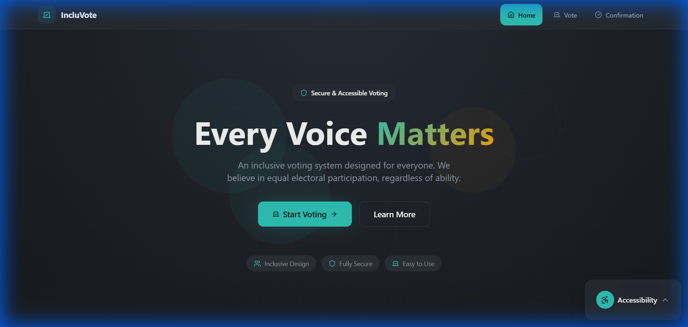
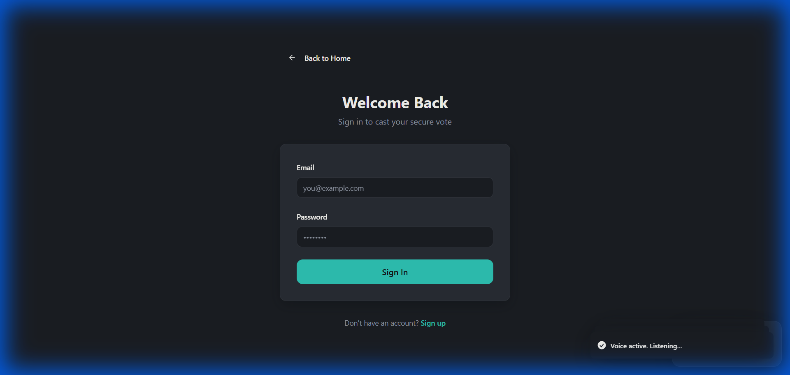
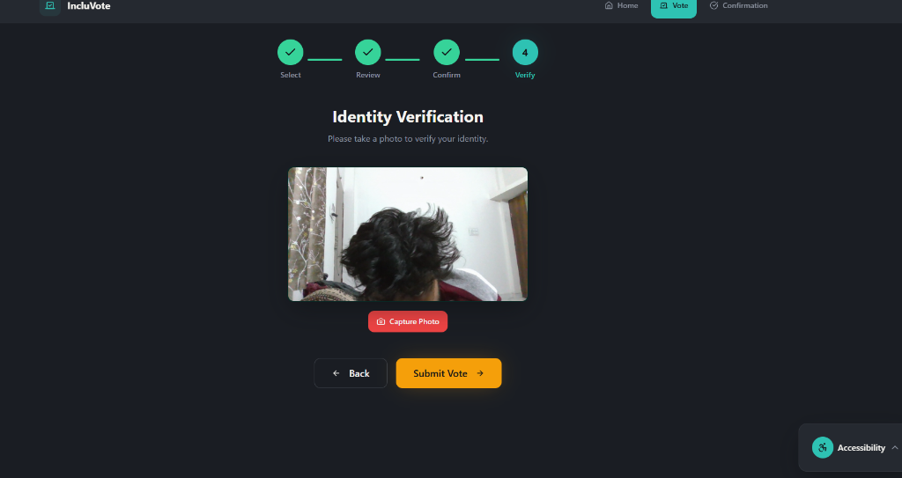
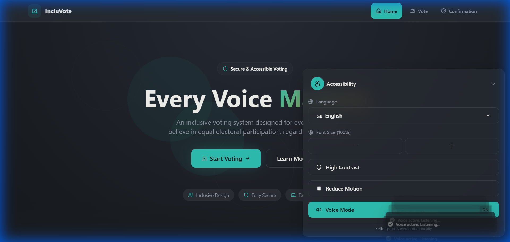

# 1. Problem Statement
**Building an accessible, inclusive, and secure voting platform** that enables users with disabilities (visual impairment, motor disabilities) to cast their votes independently using voice commands and accessibility features.

# 2. Project Name
**IncluVote** - Accessible Voice-Enabled Voting Platform

# 3. Team Name
**ByteQuest 2025** (Team localhost)

# 4. Deployed Link
> *Coming soon* <!-- Replace with your deployed URL -->

# 5. Demonstration Video (2 minutes)
> 📹 [Watch Demo Video](#) <!-- Replace with your video link -->

# 6. PPT Link
> 📊 [View Presentation](#) <!-- Replace with your PPT link -->

---

# IncluVote - Accessible Voice-Enabled Voting Platform

<div align="center">


**A modern, accessible, and secure voting web application with voice control capabilities**

</div>

---

## 📋 Project Overview

**IncluVote** is a civic-tech web application designed to make voting accessible to everyone, including users with disabilities. It features:

- 🎙️ **Voice Control**: Navigate and vote using voice commands
- 🔐 **Secure Authentication**: User signup/login via Supabase Auth
- 📷 **Photo Verification**: Camera-based identity verification before voting
- 🔒 **Encrypted Votes**: AES encryption for vote data privacy
- ♿ **Accessibility First**: High contrast mode, screen reader support, adjustable text size
- 🌐 **Multi-language Support**: Internationalization ready

### Key Features

| Feature | Description |
|---------|-------------|
| **Voice Voting** | Say "Option 1" or candidate names to select |
| **4-Step Flow** | Select → Review → Confirm → Verify (Camera) |
| **Encrypted Storage** | Vote data encrypted with CryptoJS AES |
| **Cloud Backend** | Supabase for auth, database, and file storage |
| **Responsive Design** | Works on desktop, tablet, and mobile |

---

## 🛠️ Tech Stack

- **Frontend**: React 18 + TypeScript + Vite
- **Styling**: TailwindCSS + Radix UI Components
- **Backend**: Supabase (PostgreSQL + Auth + Storage)
- **Voice**: Web Speech API (SpeechRecognition + SpeechSynthesis)
- **Camera**: react-webcam
- **Encryption**: crypto-js

---

## 🚀 Setup and Installation

### Prerequisites

- Node.js 18+ and npm
- A Supabase account (free tier works)

### 1. Clone the Repository

```bash
git clone https://github.com/ByteQuest-2025/GFGBQ-Team-localhost.git
cd GFGBQ-Team-localhost
```

### 2. Install Dependencies

```bash
npm install
```

### 3. Configure Environment Variables

Create a `.env` file in the root directory:

```env
VITE_SUPABASE_URL="https://your-project-id.supabase.co"
VITE_SUPABASE_PUBLISHABLE_KEY="your-anon-public-key"
```

> Get these values from your Supabase Dashboard → Project Settings → API

### 4. Setup Supabase Database

Run the following SQL in your Supabase SQL Editor:

```sql
-- Create storage bucket for voter photos
INSERT INTO storage.buckets (id, name, public) 
VALUES ('voter-photos', 'voter-photos', true)
ON CONFLICT (id) DO NOTHING;

-- Storage policies for authenticated users
CREATE POLICY "user_upload_policy" ON storage.objects 
FOR INSERT TO authenticated 
WITH CHECK (bucket_id = 'voter-photos' AND (storage.foldername(name))[1] = auth.uid()::text);

CREATE POLICY "user_read_policy" ON storage.objects 
FOR SELECT TO authenticated 
USING (bucket_id = 'voter-photos' AND (storage.foldername(name))[1] = auth.uid()::text);

-- Create votes table
CREATE TABLE IF NOT EXISTS public.votes (
  id UUID DEFAULT gen_random_uuid() PRIMARY KEY,
  user_id UUID REFERENCES auth.users(id) NOT NULL,
  candidate_id TEXT NOT NULL,
  encrypted_vote_data TEXT NOT NULL,
  photo_url TEXT NOT NULL,
  created_at TIMESTAMPTZ DEFAULT NOW() NOT NULL
);

-- Enable Row Level Security
ALTER TABLE public.votes ENABLE ROW LEVEL SECURITY;

-- RLS Policies
CREATE POLICY "user_insert_vote" ON public.votes FOR INSERT 
WITH CHECK (auth.uid() = user_id);

CREATE POLICY "user_read_vote" ON public.votes FOR SELECT 
USING (auth.uid() = user_id);
```

### 5. Run the Development Server

```bash
npm run dev
```

The app will be available at `http://localhost:5173`

---

## 📖 Usage Instructions

### Getting Started

1. **Sign Up**: Navigate to `/signup` and create an account
2. **Login**: Use your credentials at `/login`
3. **Start Voting**: Click "Start Voting" on the homepage

### Voting Flow

| Step | Action | Voice Command |
|------|--------|---------------|
| 1️⃣ **Select** | Choose a candidate | "Option 1", "Vote for Priya" |
| 2️⃣ **Review** | Verify your selection | "Next", "Continue" |
| 3️⃣ **Confirm** | Final confirmation | "Next", "Proceed" |
| 4️⃣ **Verify** | Take a photo | "Confirm", "Submit" |

### Voice Commands

| Command | Action |
|---------|--------|
| "Option 1" / "Option 2" | Select candidate by number |
| "Vote for [Name]" | Select candidate by name |
| "Next" / "Continue" | Proceed to next step |
| "Back" / "Previous" | Go to previous step |
| "Confirm" / "Submit" | Submit your vote |
| "Go Home" | Navigate to homepage |
| "Scroll Down" / "Scroll Up" | Scroll the page |

### Accessibility Features

Access the Accessibility Panel (bottom-right corner) to:
- 🎙️ Enable/Disable Voice Mode
- 🔤 Increase/Decrease Text Size
- 🌓 Toggle High Contrast Mode
- 🔊 Enable Screen Reader Announcements

---

## 📸 Screenshots

### Homepage
The landing page with a clean, modern design and clear call-to-action.



### Login Page
Secure authentication with email and password.



### Candidate Selection
Grid view of candidates with the 4-step voting progress indicator (Select → Review → Confirm → Verify).


### Identity Verification (Step 4)
Camera-based identity verification before vote submission. Shows webcam feed with "Capture Photo" button.



### Accessibility Panel
Floating panel with accessibility controls including voice mode toggle, font size, high contrast, and language settings.



---

## 📁 Project Structure

```
src/
├── components/          # Reusable UI components
│   ├── AccessibilityPanel.tsx
│   ├── CameraCapture.tsx
│   ├── CandidateCard.tsx
│   ├── Navbar.tsx
│   ├── VoiceControl.tsx
│   └── VotingProgress.tsx
├── contexts/            # React Context providers
│   ├── AccessibilityContext.tsx
│   └── LanguageContext.tsx
├── data/                # Static data
│   └── candidates.ts
├── integrations/        # External service integrations
│   └── supabase/
├── pages/               # Route pages
│   ├── Index.tsx
│   ├── Login.tsx
│   ├── Signup.tsx
│   ├── Vote.tsx
│   └── Confirmation.tsx
└── App.tsx              # Main application entry
```

---

## 🔒 Security Features

- **Authentication**: Supabase Auth with session management
- **Row Level Security**: Database policies restrict access to own data
- **Encrypted Votes**: AES-256 encryption for vote data
- **Photo Verification**: Identity confirmation before submission
- **Storage Policies**: Users can only access their own uploaded photos

---

## 🤝 Contributing

1. Fork the repository
2. Create a feature branch (`git checkout -b feature/AmazingFeature`)
3. Commit your changes (`git commit -m 'Add AmazingFeature'`)
4. Push to the branch (`git push origin feature/AmazingFeature`)
5. Open a Pull Request

---

## 📄 License

This project is licensed under the MIT License.

---

## 👥 Team

**ByteQuest 2025** - GFG Hackathon Team

---

<div align="center">

**Built with ❤️ by devv for accessible democracy**

</div>